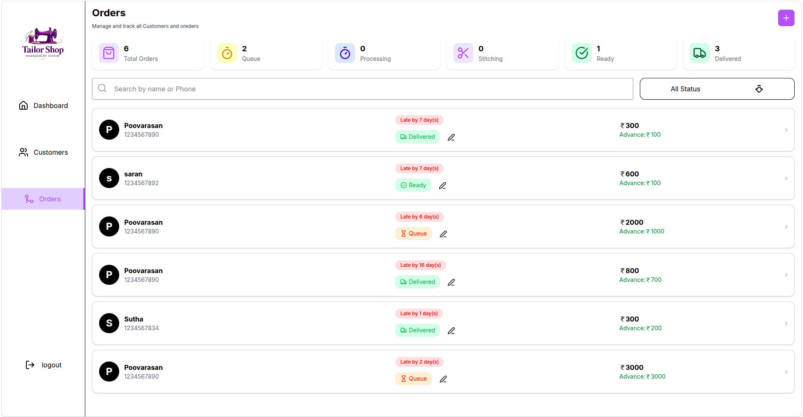
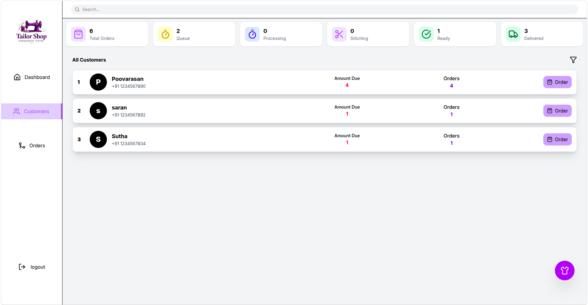

# 🧵 Stitch Flow — Frontend

A modern, responsive **Tailor Shop Management System** frontend built with **React + Vite + Tailwind CSS**. Stitch Flow helps tailor shop owners manage customers, orders, payments, delivery dates, and work status in one clean dashboard.

---

## ✨ Features

### 🔐 Authentication
- Owner login and signup
- JWT cookie-based authentication
- Protected dashboard routes
- Auto verification on page refresh

### 👥 Customer Management
- Add new customers
- View all customers
- Search customers
- Customer detail page
- Total orders count for each customer
- Mobile-friendly customer cards

### 🛍️ Order Management
- Create new orders for customers
- View all orders
- Single order detail page
- Update order status
- Track delivery date
- Track advance amount, received amount, balance amount, and payment status

### 📌 Order Status Flow

```txt
Queue → Processing → Stitching → Ready → Delivered
```

Each status can be displayed using a different color badge for better visibility.

### 📊 Dashboard Overview
- Total orders
- Today delivery orders
- Late orders
- Due payment orders
- Recent orders
- Overall revenue

### 📱 Responsive UI
- Mobile-first design
- Bottom navigation for mobile
- Modern cards and clean spacing
- Tailwind CSS utility-based styling
- Skeleton loading support

---

## 🛠️ Tech Stack

| Technology | Usage |
|---|---|
| React.js | Frontend library |
| Vite | Fast build tool |
| Tailwind CSS | Styling |
| React Router DOM | Routing |
| Axios | API requests |
| Lucide React | Icons |
| React Toastify | Notifications |
| React Loading Skeleton | Loading UI |

---

## 📁 Folder Structure

```txt
frontend/
├── public/
├── src/
│   ├── api/
│   │   └── axios.js
│   ├── assets/
│   ├── components/
│   │   ├── AddCustomer.jsx
│   │   ├── AddOrder.jsx
│   │   ├── Bottombar.jsx
│   │   ├── DashboardGrid.jsx
│   │   └── SearchCustomer.jsx
│   ├── context/
│   │   └── AuthContext.jsx
│   ├── pages/
│   │   ├── Dashboard.jsx
│   │   ├── CustomerPage.jsx
│   │   ├── CustomerDetail.jsx
│   │   ├── OrdersPage.jsx
│   │   ├── OrderDetail.jsx
│   │   ├── ProfilePage.jsx
│   │   ├── Login.jsx
│   │   └── Signup.jsx
│   ├── App.jsx
│   ├── main.jsx
│   └── index.css
├── .env
├── package.json
└── README.md
```

---

## ⚙️ Installation

Clone the repository:

```bash
git clone https://github.com/poovu1010/CRM-APP-FRONTEND.git
```

Go to the project folder:

```bash
cd CRM-APP-FRONTEND
```

Install dependencies:

```bash
npm install
```

Run the development server:

```bash
npm run dev
```

The app will run at:

```txt
http://localhost:5173
```

---

## 🔑 Environment Variables

Create a `.env` file in the root folder:

```env
VITE_BACKEND_LINK=http://localhost:5000
```

For production, replace it with your deployed backend URL:

```env
VITE_BACKEND_LINK=https://your-backend-url.com
```

---

## 📡 API Configuration

Example Axios setup:

```js
import axios from "axios";

const api = axios.create({
  baseURL: import.meta.env.VITE_BACKEND_LINK,
  withCredentials: true,
});

export default api;
```

`withCredentials: true` is required because authentication uses an HTTP-only JWT cookie.

---

## 🧭 Main Routes

| Route | Page |
|---|---|
| `/login` | Owner Login |
| `/signup` | Owner Signup |
| `/dashboard` | Dashboard |
| `/dashboard/CustomerPage` | Customers |
| `/dashboard/customer/:name/:id` | Customer Details |
| `/Orders/all-orders` | All Orders |
| `/Orders/all-orders/:name/:id` | Order Details |


---

## 🎨 Status Badge Example

```js
const statusColors = {
  Queue: "bg-slate-100 text-slate-700",
  Processing: "bg-blue-100 text-blue-700",
  Stitching: "bg-amber-100 text-amber-700",
  Ready: "bg-green-100 text-green-700",
  Delivered: "bg-emerald-100 text-emerald-700",
};
```

---

## 📦 Available Scripts

```bash
npm run dev
```
Runs the app in development mode.

```bash
npm run build
```
Builds the app for production.

```bash
npm run preview
```
Previews the production build locally.

---

## 🚀 Deployment

This frontend can be deployed on platforms like:

- Vercel
- Netlify
- Render Static Site
- AWS S3 + CloudFront

### Vercel Deployment Steps

1. Push your frontend code to GitHub.
2. Import the repository in Vercel.
3. Add environment variable:

```env
VITE_BACKEND_LINK=https://your-backend-url.com
```

4. Deploy the app.

---

## 📸 Screenshots

Add your screenshots here:

```md



```

---

## ✅ Future Improvements

- WhatsApp delivery reminders
- Order invoice download
- Customer photo upload
- Measurement management
- Monthly revenue chart
- Push notifications
- Dark mode
- Multi-shop support

---

## 👨‍💻 Author

**Poovarasan**  
Full Stack Developer  
Built with ❤️ for real tailor shop workflow.

---

